<div align="center">

<h1>Raj Tiwari</h1>
<h3>Software Engineer | Full Stack & AI Systems | Competitive Programmer</h3>

<a href="https://git.io/typing-svg">
  
</a>

<br />

<a href="https://github.com/Rajtiwari0202">
  
</a>
<a href="https://www.linkedin.com/in/raj-tiwari-687b67284">
  
</a>
<a href="mailto:rajtiwari16916@gmail.com">
  
</a>

<br />
<br />


</div>

---

## About

I engineer full stack applications, backend systems, and AI-enabled product workflows. I care about clean implementation, product judgment, and solving hard problems through code.

- Winner of HackWithUttarPradesh Hackathon
- Solved 350+ LeetCode problems
- Oracle Foundation Associate certified
- Summer Analytics 2025 participant by IIT Guwahati
- B.Tech CSE; building across full stack engineering, AI/ML, data analysis, IoT, and scalable web applications

---

## Tech Stack

<div align="center">

### Languages


### Frontend


### Backend, Database, Tools


</div>

---

## Featured Projects

<table>
  <tr>
    <td width="50%">
      <h3>AI Code Editor</h3>
      <p>A TypeScript-based developer tool exploring code editing workflows and AI-assisted programming features.</p>
      <p>
        
        
        
      </p>
      <a href="https://github.com/Rajtiwari0202/ai-code-editor">Repository</a>
    </td>
    <td width="50%">
      <h3>The Great GPTini</h3>
      <p>A JavaScript AI assistant interface with prompt handling, chat flow, and product-focused interaction design.</p>
      <p>
        
        
        
      </p>
      <a href="https://github.com/Rajtiwari0202/The-Great-GPTini">Repository</a>
    </td>
  </tr>
  <tr>
    <td width="50%">
      <h3>AgriConnect Platform</h3>
      <p>An agriculture platform for connecting farmers, landowners, and digital services through a modern web interface.</p>
      <p>
        
        
        
      </p>
      <a href="https://github.com/Rajtiwari0202/AgriConnect-Platform">Repository</a>
    </td>
    <td width="50%">
      <h3>ResQ-Her</h3>
      <p>A women safety app with emergency assistance flows, safety resources, and an accessible interface.</p>
      <p>
        
        
        
      </p>
      <a href="https://github.com/Rajtiwari0202/ResQ-Her">Repository</a>
    </td>
  </tr>
  <tr>
    <td width="50%">
      <h3>PyShop Ecommerce</h3>
      <p>A Django e-commerce platform with product browsing, cart management, checkout flow, authentication, and deployment.</p>
      <p>
        
        
        
      </p>
      <a href="https://github.com/Rajtiwari0202/PyShop-Ecommerce">Repository</a> &bull;
      <a href="https://pyshop-ecommerce-r9kl.onrender.com/">Live Demo</a>
    </td>
    <td width="50%">
      <h3>Vestora Trading Platform</h3>
      <p>A trading dashboard project with market views, portfolio sections, watchlists, and data-focused UI components.</p>
      <p>
        
        
        
      </p>
      <a href="https://github.com/Rajtiwari0202/vestora-trading-platform">Repository</a>
    </td>
  </tr>
  <tr>
    <td width="50%">
      <h3>Blue Carbon Credit Registry System</h3>
      <p>A sustainability-focused registry system for tracking blue carbon credits and environmental impact data.</p>
      <p>
        
        
        
      </p>
      <a href="https://github.com/Rajtiwari0202/Blue-Carbon-Credit-Registry-System">Repository</a>
    </td>
    <td width="50%">
      <h3>PolicyGuard</h3>
      <p>A local LLM-powered policy gap analyzer for reviewing documents, tracking policy gaps, and generating improved policy drafts.</p>
      <p>
        
        
        
      </p>
      <a href="https://github.com/Rajtiwari0202/PolicyGuard-Local-LLM-Powered-Policy-Gap-Analyzer-">Repository</a>
    </td>
  </tr>
</table>

---

## Project Screenshots

<table>
  <tr>
    <td width="33%">
      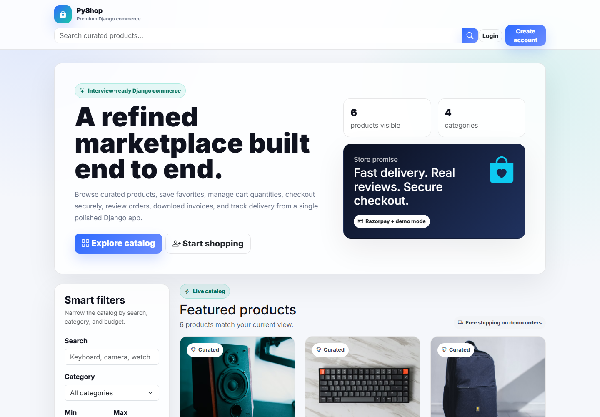
      <p align="center"><b>PyShop Ecommerce</b></p>
    </td>
    <td width="33%">
      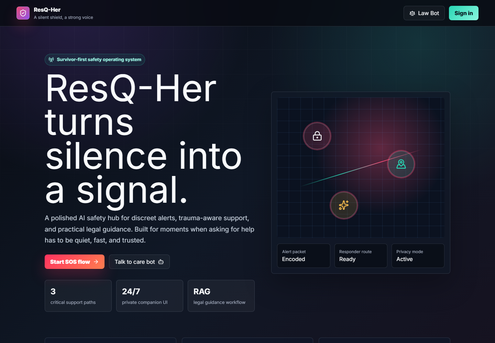
      <p align="center"><b>ResQ-Her</b></p>
    </td>
    <td width="33%">
      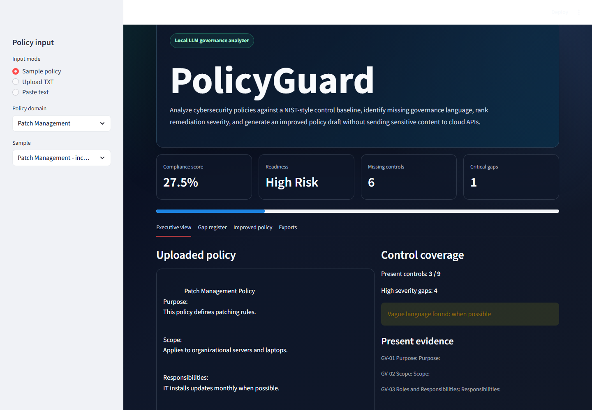
      <p align="center"><b>PolicyGuard</b></p>
    </td>
  </tr>
</table>

<details>
  <summary><b>PyShop Ecommerce Screens</b></summary>
  <br />
  <table>
    <tr>
      <td width="50%"></td>
      <td width="50%">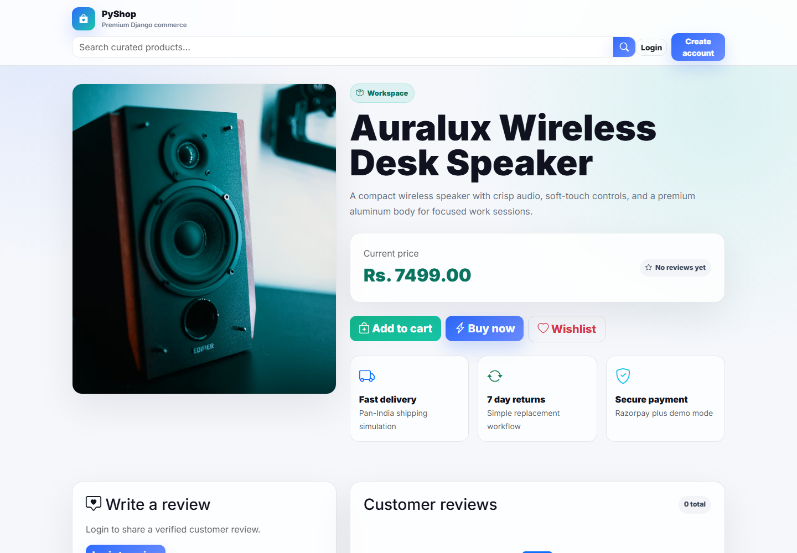</td>
    </tr>
    <tr>
      <td width="50%">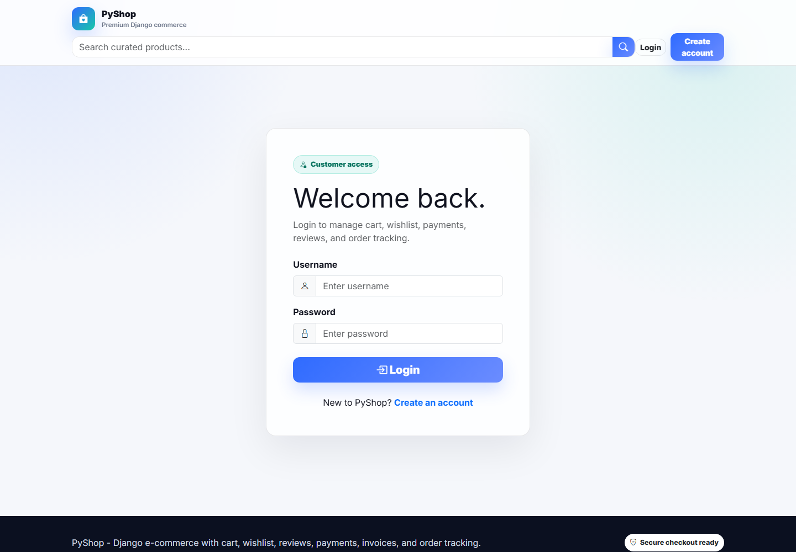</td>
      <td width="50%">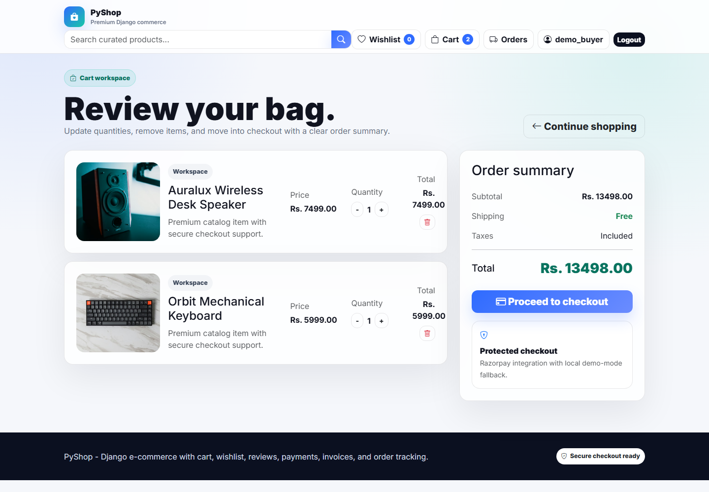</td>
    </tr>
    <tr>
      <td width="50%">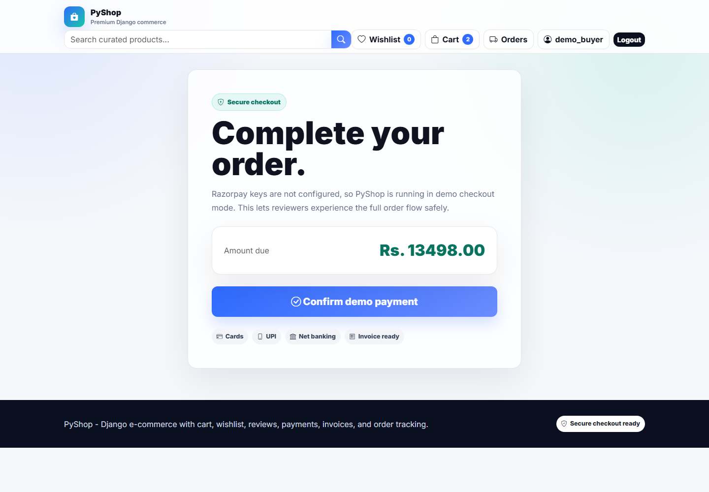</td>
      <td width="50%">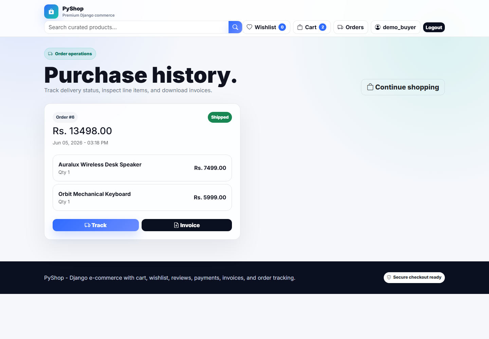</td>
    </tr>
  </table>
</details>

<details>
  <summary><b>ResQ-Her Screens</b></summary>
  <br />
  <table>
    <tr>
      <td width="50%"></td>
      <td width="50%">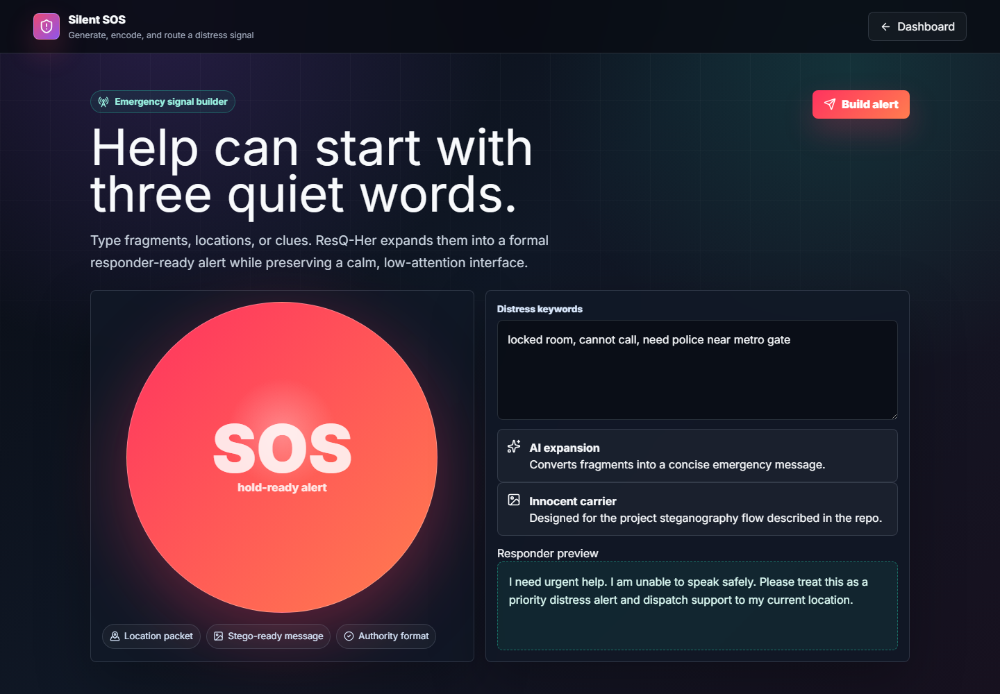</td>
    </tr>
    <tr>
      <td width="50%">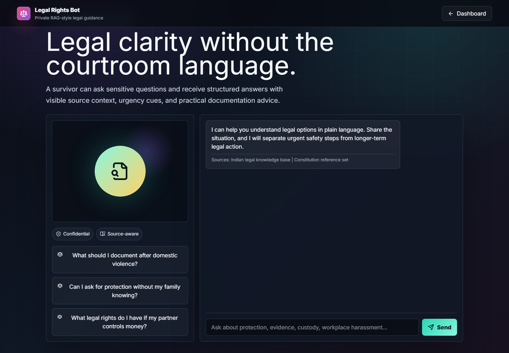</td>
      <td width="50%">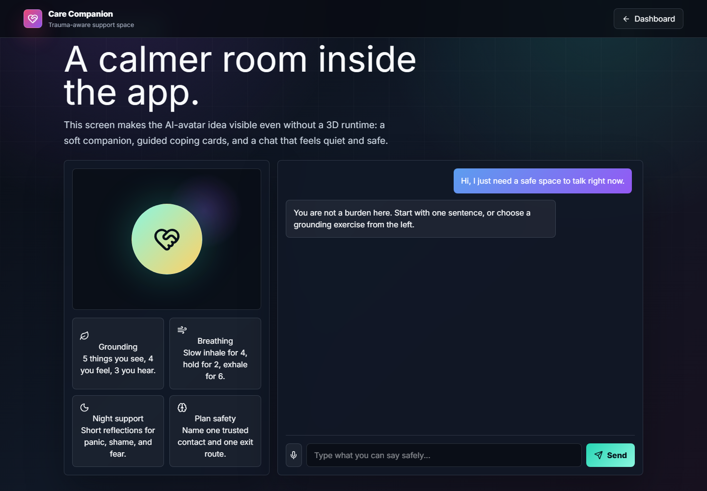</td>
    </tr>
  </table>
</details>

<details>
  <summary><b>PolicyGuard Screens</b></summary>
  <br />
  <table>
    <tr>
      <td width="50%"></td>
      <td width="50%">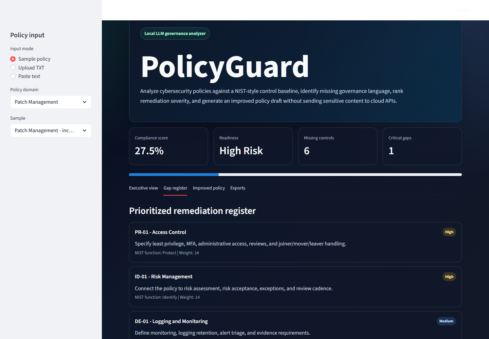</td>
    </tr>
    <tr>
      <td width="50%">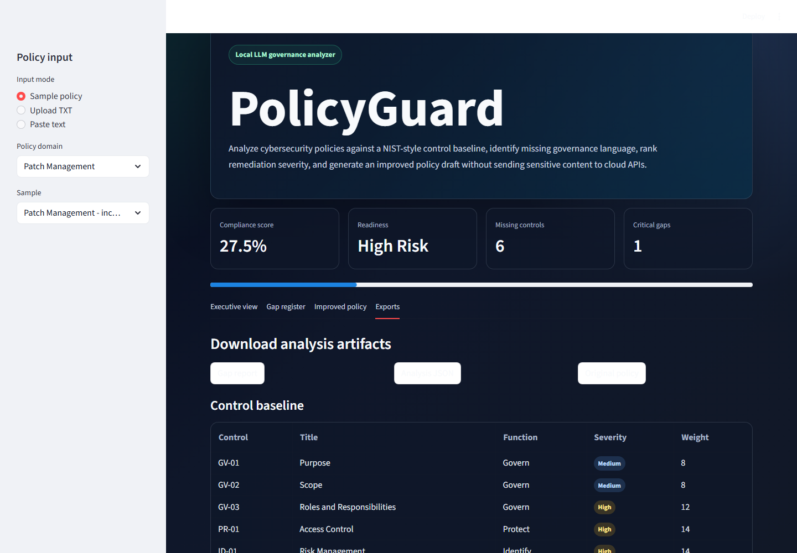</td>
      <td width="50%">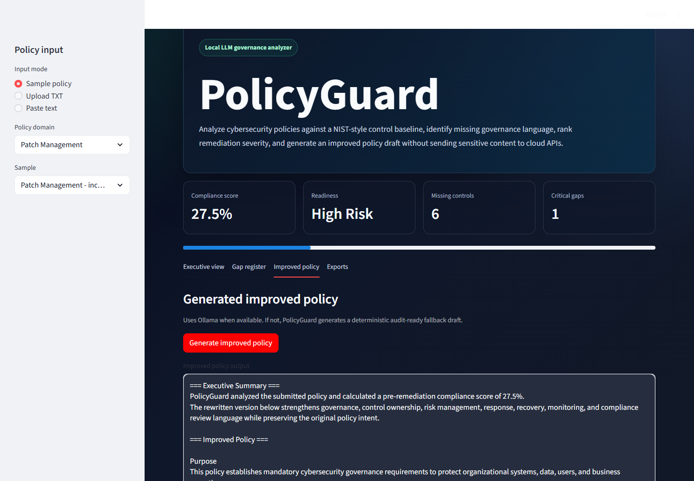</td>
    </tr>
  </table>
</details>

---

## GitHub Analytics

<div align="center">


<br />
<br />


<br />
<br />


</div>

---

## Competitive Programming

<div align="center">


</div>

```txt
Core focus:
- Data Structures and Algorithms
- Competitive Programming
- Interview Preparation
```

---

## Achievements

<table>
  <tr>
    <td>Winner</td>
    <td><b>HackWithUttarPradesh Hackathon</b></td>
  </tr>
  <tr>
    <td>Certified</td>
    <td><b>Oracle Foundation Associate</b></td>
  </tr>
  <tr>
    <td>Participant</td>
    <td><b>Summer Analytics 2025 by IIT Guwahati</b></td>
  </tr>
  <tr>
    <td>DSA</td>
    <td><b>350+ LeetCode problems solved</b></td>
  </tr>
</table>

---

## Contribution Graph

<div align="center">


</div>

---

<div align="center">

### Building useful software, one project at a time.

</div>
